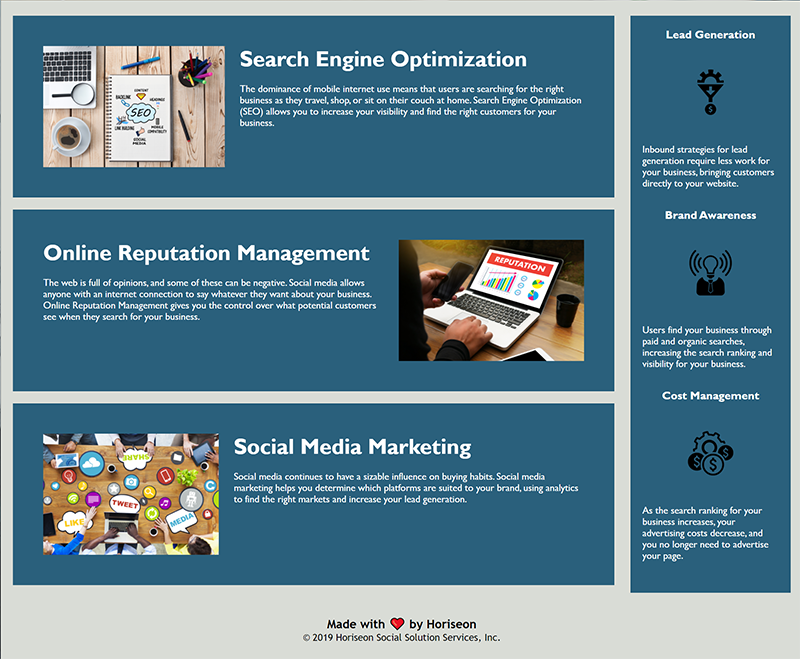

# Week01-Code-Refactor

Refactor original client website for accessibility

## Expected Behavior

* Semantic HTML elements

* Elements follow logical structure independent of style and postion

* Image elements should have accessible alt attibutes

* Headings in sequential order

* A concise and descriptive title

## Link to deployed application

[GitHub](https://fett-boba.github.io/Week01-Code-Refactor) https://fett-boba.github.io/Week01-Code-Refactor

## Assets

The following images demonstrate that existing functionality remains intact after the refactor for accessibility.

---
